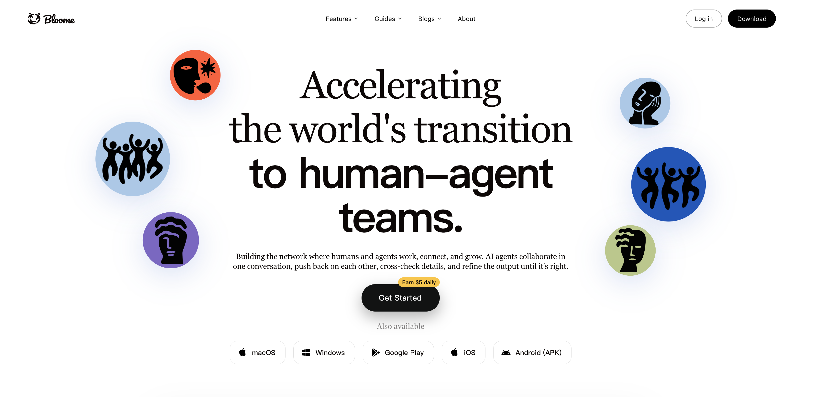

# JS Reverse MCP

[English](README_en.md) | 中文

AI-first / AI-native 的 JavaScript 逆向工程 MCP Server，让你的 AI 编码助手（如 Claude、Cursor、Copilot）能够像分析师一样持续调试、定位、保存和复盘网页中的 JavaScript 行为。

它不是把 Chrome DevTools API 原样搬给模型，而是把脚本、断点、网络、WebSocket、浏览器状态和本地文件 I/O 重新组织成适合 AI Agent 连续推理和操作的工具。反检测是其中一部分能力：默认基于 [Patchright](https://github.com/Kaliiiiiiiiii-Vinyzu/patchright-nodejs) 协议层 stealth，对强反爬站点可选启用 [CloakBrowser](https://github.com/CloakHQ/CloakBrowser) 源码层指纹模式。

## ☁️ 赞助 · Sponsored by Bloome

<p align="center">
  <a href="https://bloome.im/app?ref=zhizhuodemao&amp;utm_medium=github&amp;utm_source=zhizhuodemao-js-reverse-mcp-ivor-202607">
    
  </a>
</p>

Bloome 是一个 AI Agent IM 平台：不是你对着一个 bot 单打独斗，而是让多个 AI agent（Claude、ChatGPT、DeepSeek 等）和你待在同一个群聊里协作。

把任务丢进对话，它们会自动分工——起草、交叉核对、补全细节，彼此挑错、互相补位，直到结果靠谱为止，并直接在对话里生成表格、文档和可视化看板。还能按计划 7×24 自动运行（比如每天定时整理报表发进频道），零本地配置、云端运行，网页和手机都能用；配好的 agent 一键分享给团队，无需各自部署。

一句话：把"我 + 一个助手"升级成"我的团队 + 一群会协作的 agent"。

👉 试试 [Bloome](https://bloome.im/app?ref=zhizhuodemao&utm_medium=github&utm_source=zhizhuodemao-js-reverse-mcp-ivor-202607)

## 功能特点

- **AI-native 工具设计**：工具粒度、输出边界和错误提示都围绕 Agent 决策设计，避免把模型推向无效下一步
- **可复盘工作流**：脚本源码、网络原始数据、二进制结果都能导出到本地文件，再作为后续分析输入
- **断点上下文执行**：暂停时可直接在 call frame 中求值，检查作用域变量，单步执行并返回源码上下文
- **脚本分析**：列出所有加载的 JS，搜索代码，获取/保存源码，自动格式化大型压缩脚本
- **网络与 WebSocket 分析**：请求调用栈、XHR 断点、Set-Cookie 识别、原始 body/header 导出、WebSocket 消息分组
- **浏览器状态重放**：清理当前站点 cookies / cache / storage / sessionStorage，配合 reload 复现 cookie 和风控流程
- **默认有头 + 持久化登录态**：看得到浏览器，cookies / localStorage 跨会话保留
- **可选反检测层**：Patchright 协议层 stealth 默认启用；强反爬站点可加 `--cloak` 使用 CloakBrowser 二进制

## 系统要求

- [Node.js](https://nodejs.org/) v20.19 或更新版本
- [Chrome](https://www.google.com/chrome/) 稳定版

## 快速开始（npx）

无需安装，直接在 MCP 客户端配置中添加：

```json
{
  "mcpServers": {
    "js-reverse": {
      "command": "npx",
      "args": ["js-reverse-mcp"]
    }
  }
}
```

### Claude Code

```bash
claude mcp add js-reverse npx js-reverse-mcp
```

### Codex

```bash
codex mcp add js-reverse -- npx js-reverse-mcp
```

### Cursor

进入 `Cursor Settings` -> `MCP` -> `New MCP Server`，使用上面的配置。

### VS Code Copilot

```bash
code --add-mcp '{"name":"js-reverse","command":"npx","args":["js-reverse-mcp"]}'
```

## 本地安装（可选）

```bash
git clone https://github.com/zhizhuodemao/js-reverse-mcp.git
cd js-reverse-mcp
npm install
npm run build
```

然后在 MCP 配置中使用本地路径：

```json
{
  "mcpServers": {
    "js-reverse": {
      "command": "node",
      "args": ["/你的路径/js-reverse-mcp/build/src/index.js"]
    }
  }
}
```

## AI-first 设计

这个项目的核心目标不是“能操作浏览器”，而是让 AI Agent 能稳定完成一轮真实 JS 逆向任务：打开页面、过风控、定位脚本、保存源码、设置断点、触发行为、检查运行时、导出网络材料、复现状态，然后继续推理。

几个设计取向贯穿在代码里：

- **工具是 Agent primitives，不是 DevTools 菜单映射**：`list_network_requests` 既能列索引，也能按 `reqid` 查详情，还能用 `outputFile` 导出精确材料；`evaluate_script` 既能在页面执行，也能在断点 call frame 执行，还能接收 `localFilePath` 输入。
- **输出要能指导下一步**：列表输出保持短而可扫描；详情输出有边界；长结果提示导出；pending 请求会明确提示先恢复执行，避免 Agent 等一个永远不会完成的 response。
- **本地文件是分析工作台**：`save_script_source`、`list_network_requests(..., outputFile)`、`evaluate_script(..., localFilePath)` 让 Agent 能在浏览器、网络和本地文件之间往返，而不是把大段代码或二进制数据塞进聊天上下文。
- **状态可清理、流程可重放**：默认 profile 保留登录态；`--isolated` 提供一次性干净环境；`clear_site_data` 只清当前站点相关状态，用来反复复现 cookie 生成、风控初始化和请求链路。
- **反检测服务于调试链路**：CDP 静默导航、真实视口、Google referer、Patchright 和 CloakBrowser 的目标都是让 Agent 能进入目标页面继续分析，而不是把项目变成一个泛用爬虫框架。

## 反检测机制（支撑能力）

反检测是 js-reverse-mcp 的底层支撑能力之一。包装层（这个 MCP 自己）**零 JS 注入**、不做 `Object.defineProperty` hack（那本身就是检测信号）。所有反检测都在两个互不重叠的层：

| 层                             | 默认模式                                                                                                        | `--cloak` 模式                                                                                                                    |
| ------------------------------ | --------------------------------------------------------------------------------------------------------------- | --------------------------------------------------------------------------------------------------------------------------------- |
| **协议层**（CDP）              | Patchright：不调 `Runtime.enable` / `Console.enable`，在 isolated world 里执行 evaluate，移除自动化 launch flag | 同                                                                                                                                |
| **源码层**（C++ 二进制 patch） | 无 —— 直接用系统 Google Chrome                                                                                  | CloakBrowser 二进制（按平台提供源码层指纹 patch，覆盖 `navigator.webdriver`、canvas、WebGL、audio、GPU、字体、屏幕、WebRTC、TLS） |
| **Profile 目录**               | `~/.cache/chrome-devtools-mcp/chrome-profile`（持久化登录态）                                                   | `~/.cache/chrome-devtools-mcp/cloak-profile`（与默认物理隔离）                                                                    |
| **实际浏览器**                 | 你装的 Google Chrome（带 Web Store、扩展、sync）                                                                | 定制 Chromium 编译版（无 Google 服务、无 Web Store）                                                                              |

另外几个导航级措施（两种模式都生效）：

- **CDP 静默导航** —— 页面加载时不激活 `Network.enable` / `Debugger.enable`，请求/控制台收集只走 Playwright 监听器，直到某个工具显式需要 CDP 才激活
- **Google Referer** —— `new_page` 默认带 `referer: https://www.google.com/`
- **真实视口** —— 关掉 Playwright 默认的 1280×720 假视口，浏览器展示真实屏幕尺寸

**何时开 `--cloak`**：只在以上还不够、被站点指纹拦截时才用。详见 [docs/cloak.md](docs/cloak.md)。

## 工具列表（24 个）

### 页面与导航

| 工具              | 描述                                       |
| ----------------- | ------------------------------------------ |
| `select_page`     | 列出打开的页面，或按索引选择调试上下文     |
| `new_page`        | 创建新页面并导航到 URL                     |
| `navigate_page`   | 导航、后退、前进或刷新页面                 |
| `select_frame`    | 列出所有 frame（iframe），或选择执行上下文 |
| `click_element`   | 严格匹配并点击当前 frame 中的单个可见元素  |
| `take_screenshot` | 截取页面截图                               |

### 脚本分析

| 工具                 | 描述                                                   |
| -------------------- | ------------------------------------------------------ |
| `list_scripts`       | 列出页面中所有加载的 JavaScript 脚本                   |
| `get_script_source`  | 获取脚本源码片段，支持行范围或字符偏移                 |
| `save_script_source` | 保存完整脚本源码到本地文件（适用于大型/压缩/WASM文件） |
| `search_in_sources`  | 在所有脚本中搜索字符串或正则表达式                     |

### 断点与执行控制

| 工具                     | 描述                                            |
| ------------------------ | ----------------------------------------------- |
| `set_breakpoint_on_text` | 通过搜索代码文本自动设置断点（适用于压缩代码）  |
| `break_on_xhr`           | 按 URL 模式设置 XHR/Fetch 断点                  |
| `remove_breakpoint`      | 用显式 action 按 ID、URL 或全部移除断点         |
| `list_breakpoints`       | 列出所有活动断点                                |
| `get_paused_info`        | 获取暂停状态、调用栈和作用域变量                |
| `pause_or_resume`        | 用显式 action 暂停或恢复执行                    |
| `step`                   | 单步调试（over/into/out），返回位置和源码上下文 |

### 网络与 WebSocket

| 工具                     | 描述                                                        |
| ------------------------ | ----------------------------------------------------------- |
| `list_network_requests`  | 列出网络请求、查看详情，或导出 header/body/query 等原始材料 |
| `clear_network_requests` | 显式确认后清空当前页面已收集的请求和 body cache             |
| `get_request_initiator`  | 获取网络请求的 JavaScript 调用栈                            |
| `get_websocket_messages` | 列出 WebSocket 连接、分析消息模式或获取消息详情             |

### 浏览器状态

| 工具              | 描述                                                                                      |
| ----------------- | ----------------------------------------------------------------------------------------- |
| `clear_site_data` | 清理当前站点相关 cookies、origin storage 和 sessionStorage；可显式选择清理全局 HTTP cache |

### 检查工具

| 工具                    | 描述                                                                          |
| ----------------------- | ----------------------------------------------------------------------------- |
| `evaluate_script`       | 在页面或断点上下文执行 JavaScript，支持主世界、保存结果和读取一个本地输入文件 |
| `list_console_messages` | 列出控制台消息，或按 msgid 获取单条详情                                       |

## 使用示例

### JS 逆向基本流程

1. **打开目标页面**

```
打开 https://example.com 并列出所有加载的 JS 脚本
```

2. **查找目标函数**

```
在所有脚本中搜索包含 "encrypt" 的代码
```

3. **设置断点**

```
在加密函数入口处设置断点
```

4. **触发并分析**

```
在页面上触发操作，断点命中后检查参数、调用栈和作用域变量
```

### WebSocket 协议分析

```
列出 WebSocket 连接，分析消息模式，查看特定类型的消息内容
```

### Agent 推荐的完整捕获流程

因为导航阶段会刻意保持 CDP 静默，首次进入目标页时不会立即打开 Network / Debugger 域。推荐流程是先过风控，再刷新捕获：

```
1. new_page 打开目标页
2. 调用 list_network_requests 激活 collectors
3. navigate_page(type="reload") 刷新页面
4. 再次 list_network_requests 查看完整请求
5. 对关键 reqid 使用 outputFile 导出原始材料
```

### Cookie / 风控重放流程

```
1. clear_site_data(confirm=true) 清理当前站点状态
2. navigate_page(type="reload") 重新触发初始化
3. list_network_requests 找到设置 cookie 或提交 sensor 的请求
4. 导出 requestBody / responseHeaders / responseBody
5. 用 evaluate_script + localFilePath 在页面上下文中复算或验证
```

## 配置选项

CLI 保持精简，所有 flag 都是可选项。**99% 场景默认即可**。涉及本地文件时，建议用 `--allowedRoots` 限定 Agent 可读写的目录。

| 选项               | 描述                                                                                                                                                                                                                      | 默认值  |
| ------------------ | ------------------------------------------------------------------------------------------------------------------------------------------------------------------------------------------------------------------------- | ------- |
| `--cloak`          | 切换到 CloakBrowser 隐身二进制（取代系统 Chrome）。启用按平台提供的 C++ 源码层指纹 patch。首次启动自动下载 ~200MB 二进制；指纹身份按 profile 持久化。详见 [docs/cloak.md](docs/cloak.md)。                                | `false` |
| `--isolated`       | 使用临时 user-data-dir（cookies/localStorage 不保留，关闭时自动清理）                                                                                                                                                     | `false` |
| `--browserUrl, -u` | 连接到已运行的 Chrome 实例（CDP HTTP 端点，如 `http://127.0.0.1:9222`）。MCP 会自动探测出 WebSocket debugger URL。本地 Chrome、AdsPower、BitBrowser 等怎么拿到这个端点详见 [docs/cdp-endpoint.md](docs/cdp-endpoint.md)。 | –       |
| `--logFile`        | 写入 `0600` 普通文件的 MCP 调试日志；详细日志仅使用 `DEBUG=mcp:*`。不要使用 `DEBUG=*`，浏览器协议日志可能泄露页面、Cookie、脚本和凭据。                                                                                   | –       |
| `--allowedRoots`   | 可重复指定 Agent 允许读写的本地目录；解析真实路径并拒绝符号链接越界。启用时禁用 `file:`、`view-source:file:` 和 `filesystem:file:` 浏览器页面。未指定时本地文件访问不受目录限制，启动时会打印安全警告。                   | –       |

### 示例配置

**默认 —— 系统 Chrome + 持久化登录态**（绝大多数调试场景推荐）：

```json
{
  "mcpServers": {
    "js-reverse": {
      "command": "npx",
      "args": ["js-reverse-mcp"]
    }
  }
}
```

**`--cloak` —— 强反爬站点**（Cloudflare Turnstile / DataDome / FingerprintJS 防护）：

> **强烈推荐：先把二进制预下载好**（一次性，~30–60 秒）。**不做这一步**的话，首次启动带 `--cloak` 的 MCP 会**静默下载 ~200MB**，看起来像 MCP 卡住了：
>
> ```bash
> npx cloakbrowser install
> ```
>
> （`cloakbrowser` 包已经通过 `optionalDependencies` 一起装好，这条命令只是触发它自带的二进制下载逻辑，有进度条）

```json
{
  "mcpServers": {
    "js-reverse-cloak": {
      "command": "npx",
      "args": ["js-reverse-mcp", "--cloak"]
    }
  }
}
```

**两套并行** —— 两个 MCP 实例 profile 物理隔离，根据目标站点切换：

```json
{
  "mcpServers": {
    "js-reverse": {
      "command": "npx",
      "args": ["js-reverse-mcp"]
    },
    "js-reverse-cloak": {
      "command": "npx",
      "args": ["js-reverse-mcp", "--cloak"]
    }
  }
}
```

**`--isolated` —— 每次全新 profile**（不保留 cookies/localStorage）：

```json
{
  "mcpServers": {
    "js-reverse": {
      "command": "npx",
      "args": ["js-reverse-mcp", "--isolated"]
    }
  }
}
```

### 连接到已运行的 Chrome / 第三方指纹浏览器

`--browserUrl` 只接受 **CDP endpoint**（能响应 `/json/version` 的 HTTP 端点），不接受厂商私有 Local API。本地 Chrome、AdsPower、BitBrowser 等场景下怎么拿到 CDP 端口，详见专门的文档：

📖 **[docs/cdp-endpoint.md —— 如何拿到 CDP 调试端口](docs/cdp-endpoint.md)**

最短路径（本地 Chrome）：

```bash
# 先关掉所有 Chrome 窗口，然后
/Applications/Google\ Chrome.app/Contents/MacOS/Google\ Chrome \
  --remote-debugging-port=9222 --user-data-dir=/tmp/chrome-debug
```

```json
{
  "mcpServers": {
    "js-reverse": {
      "command": "npx",
      "args": ["js-reverse-mcp", "--browserUrl", "http://127.0.0.1:9222"]
    }
  }
}
```

指纹浏览器（AdsPower、BitBrowser 等）的 CDP 端口是**每次启动随机变化**的，必须通过厂商 Local API 启动浏览器后再提取，操作步骤和示例脚本都在上面那篇文档里。

## 故障排除

### 被反爬系统拦截

如果访问某些站点被拦截（如知乎返回 40362、Cloudflare 挑战死循环）：

1. **先试 `--isolated`** —— 用全新 profile 排除残留状态污染：
   ```json
   "args": ["js-reverse-mcp", "--isolated"]
   ```
2. **还不行就开 `--cloak`** —— 启用按平台提供的源码层指纹 patch：
   ```json
   "args": ["js-reverse-mcp", "--cloak"]
   ```
3. **最后再考虑手动清持久化 profile**（会丢登录态）：
   ```bash
   rm -rf ~/.cache/chrome-devtools-mcp/chrome-profile
   ```

什么时候该开 `--cloak`、什么时候不该开，详见 [docs/cloak.md](docs/cloak.md)。

## Agent 路由评测（维护者）

`npm run eval:routing:validate` 会离线校验实际 MCP `tools/list`、server instructions 与 `evals/tool-routing.json` 的 30 条工具选择契约；该命令不会访问模型端点，并已纳入 presubmit。

真实模型评测是显式 opt-in，会逐条调用 OpenAI-compatible Chat Completions 端点并可能产生费用：

```bash
MCP_ROUTING_EVAL_ENDPOINT=https://api.example.com/v1/chat/completions \
MCP_ROUTING_EVAL_MODEL=model-name \
MCP_ROUTING_EVAL_API_KEY=secret \
npm run eval:routing
```

`MCP_ROUTING_EVAL_API_KEY` 对无需认证的本地端点可省略；带凭据的远程端点必须使用 HTTPS，HTTP 仅允许 loopback。可用 `MCP_ROUTING_EVAL_TIMEOUT_MS` 调整单条请求超时。默认要求 100% 通过，跨模型对比时可用 `MCP_ROUTING_EVAL_MIN_PASS_RATE` 设置 `(0, 1]` 阈值。评测不会输出 API key、endpoint 或端点错误响应正文。

## 安全提示

此工具会将浏览器内容暴露给 MCP 客户端，允许检查、调试和修改浏览器中的任何数据。请勿在包含敏感信息的页面上使用。

`evaluate_script.localFilePath`、各类 `outputFile`/`filePath` 会让 MCP 进程读取或写入宿主机文件。生产或共享环境应使用一个或多个 `--allowedRoots` 收窄到专用工作目录；未配置时访问范围不受限制。启用 `--allowedRoots` 后，`file:`、`view-source:file:` 和 `filesystem:file:` 浏览器页面也会被拒绝，避免通过浏览器导航绕过目录边界；需要调试本地页面时，只能在明确接受本地文件暴露风险的会话中不配置该选项。

## 许可证

Apache-2.0
